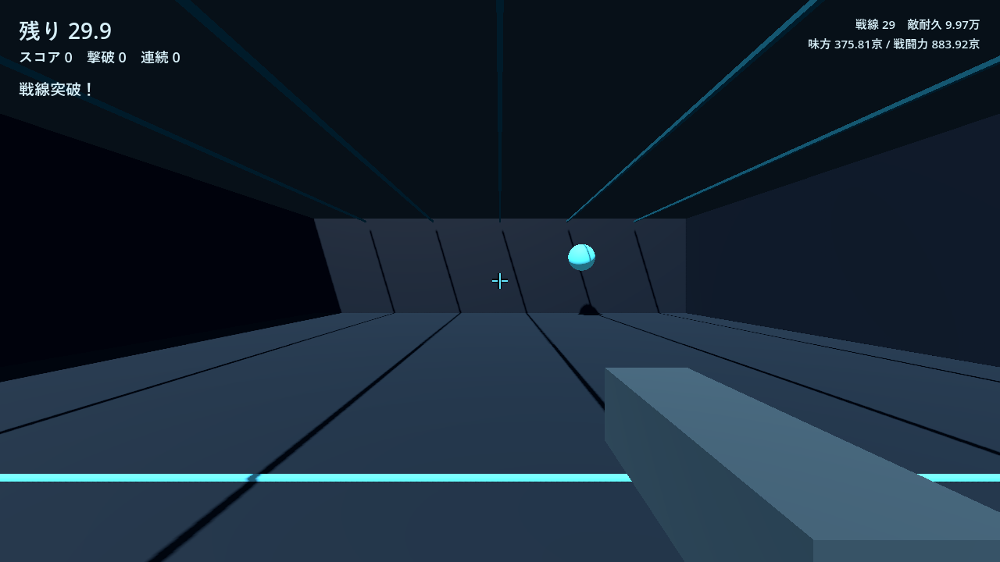
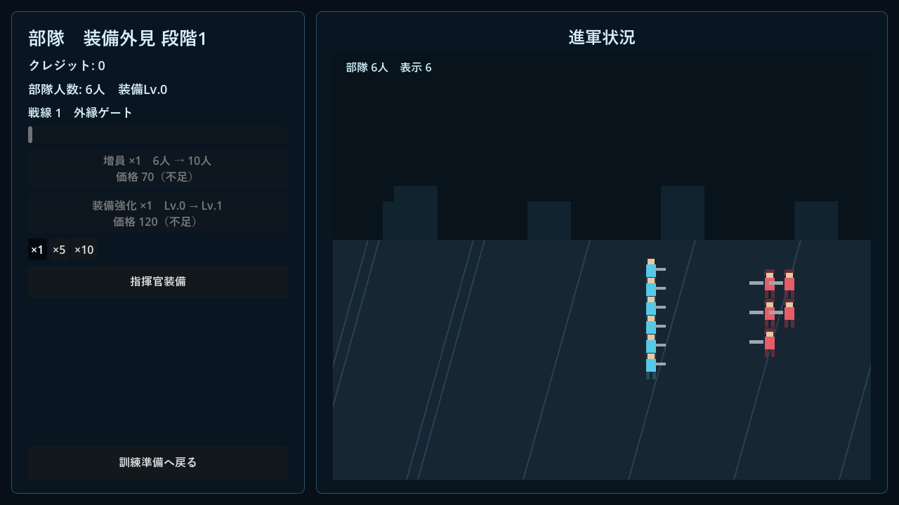
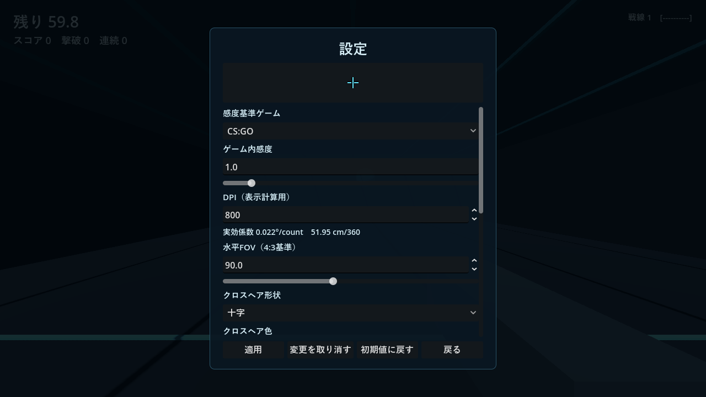
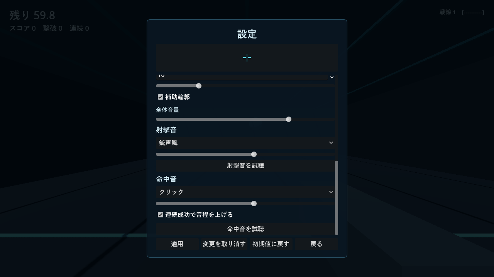

# SUPPLY LINE TRAINER

エイム訓練でクレジットを稼ぎ、自動戦闘する部隊を強化する小規模3Dゲームです。クレジットは訓練結果からのみ獲得できます。

## 起動

[Releases](../../releases) からWindows版ZIPをダウンロードして展開し、`SupplyLineTrainer.exe` を起動してください。同じフォルダーの `SupplyLineTrainer.pck` が必要です。Windows 10/11 64bit向けです。

## 操作

- WASD: 移動
- マウス: 視点
- 左クリック: 射撃
- Esc: 訓練中のみ一時停止

準備画面で武器・難易度・30秒／60秒を選び、「訓練開始」を押します。選択中の項目はチェック表示され、未開放武器には開放条件が表示されます。ハンドガンは単発、オートライフルは長押し連射、バーストライフルは1クリック3発です。訓練中のEscメニューから、その時点の成果を精算して途中終了できます。

「部隊画面」では、増員と装備強化を行い、ピクセル兵士の隊列と進軍を確認できます。購入数は×1／×5／×10です。指揮官装備は小さな専用パネルで購入・装備します。自動戦闘は進みますが、起動時間、放置、戦線突破からクレジットは発生しません。

| 初期部隊 | 成長後の部隊 |
| --- | --- |
|  |  |

設定画面はCS:GO／VALORANT／Apex Legends基準の腰だめ感度、DPIとcm/360、4:3基準FOV、4種類のクロスヘア、色・サイズ・補助輪郭に対応しています。射撃音と命中音はそれぞれ3種類と「なし」から選択でき、個別音量、試聴、連続成功による控えめな音程上昇を設定できます。音はゲーム内で合成しており、外部音源は使用していません。

## 開発環境

- Godot Engine 4.7.2 stable
- GDScript
- GL Compatibility renderer
- 外部アセット／プラグインなし

プロジェクト編集時は `project.godot` をGodot 4.7.2で開いてください。主要な調整値は `balance.gd` に集約しています。

## 検証

実施済みの検証内容と未確認事項は [VERIFY.md](VERIFY.md) に記載しています。テスト用スクリプトはゲーム本体の書き出し対象から除外されています。

## 保存

進行、時間別の自己ベスト、設定、指揮官装備はGodotのユーザーデータ領域に `save_v1.json` として自動保存されます。version 4への初回移行では、旧セーブを `save_before_growth_reset_v4.json` へ退避してから育成部分だけを一度リセットします。感度、FOV、クロスヘア、音量、新採点の記録は維持します。

戦線は継続生成されますが、部隊人数は初期6人から増員ごとに4人ずつ増える通常範囲の整数です。街・地球・銀河などの巨大規模演出と指数的人数増加は通常進行から削除しました。

## 既知の制約

- Godot 4.7.2の `InputEventMouseMotion.screen_relative` を優先し、利用できないイベントでは `relative` を使用します。入力差分へdeltaTimeやDPIは掛けませんが、物理マウスカウントとの完全一致は実機比較が必要です。
- UIは論理Viewportとアンカーを基準に追従します。Windows表示倍率100%以外での実機操作は未確認です。
- 感度一致は同じDPIでのcm/360を対象とし、FOVの見かけ、ADS、反動、入力遅延は再現対象外です。
- 実機での長時間プレイによる経済バランスは、計算シミュレーションで調整した目安です。
